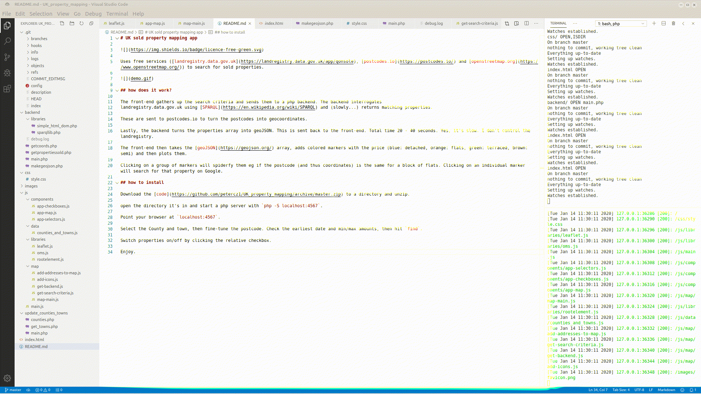

# UK sold property mapping app


Uses free services ([landregistry.data.gov.uk](https://landregistry.data.gov.uk/app/qonsole), [postcodes.io](https://postcodes.io/) and [openstreetmap.org](https://www.openstreetmap.org/)) to search for sold properties.

Demo clip shows a search for all properties sold in Ryde PO33 1xx, £100k to £300k sold since Jan 1st 2018:



## how does it work?

The front-end gathers up the search criteria and sends them to a php backend. The backend interrogates 
landregistry.data.gov.uk using [SPARQL](https://en.wikipedia.org/wiki/SPARQL) and (eventually...) returns matching properties.

These are sent to postcodes.io to turn the postcodes into geocoordinates.

Lastly, the backend turns the properties array into geoJSON. This is sent back to the front-end. Total time 5 - 45 seconds. Yes, it's slow. I don't control the landregistry.

The front-end then takes the [geoJSON](https://geojson.org/) array, adds colored markers with the price (blue: detached, orange: flats, green: terraced, brown: semi) and then plots them.

Clicking on a group of markers will spiderfy them if the postcode (and thus coordinates) is the same eg for a block of flats. Clicking on an individual marker will open Google and search images for that property. You may even be lucky and get the original agent's photos...

## what does it look like?

```
-------------------------------------------------------------------------------
Language                     files          blank        comment           code
-------------------------------------------------------------------------------
JavaScript                      12           2725           3477           8808
PHP                              9            478            426           2569
CSS                              1             21              3            110
Markdown                         1             19              0             21
HTML                             1             11              0             20
-------------------------------------------------------------------------------
SUM:                            24           3254           3906          11528

├── backend
│   ├── debug.log
│   ├── getcoords.php
│   ├── getpropertiessold.php
│   ├── libraries
│   │   ├── simple_html_dom.php
│   │   └── sparqllib.php
│   ├── main.php
│   └── makegeojson.php
├── css
│   └── style.css
├── images
│   └── favicon.png
├── index.html
├── js
│   ├── components
│   │   ├── app-checkboxes.js
│   │   ├── app-map.js
│   │   └── app-selectors.js
│   ├── data
│   │   └── counties_and_towns.js
│   ├── libraries
│   │   ├── leaflet.js
│   │   ├── oms.js
│   │   └── rootelement.js
│   ├── main.js
│   └── map
│       ├── add-addresses-to-map.js
│       ├── add-icons.js
│       ├── get-backend.js
│       ├── get-search-criteria.js
│       └── map-main.js
├── README.md
└── update_counties_towns
    ├── counties.php
    ├── get_towns.php
    └── main.php
```

## requirements

This was built on Ubuntu 19.04, php 7.3 and chromium but any box running php 7.x and a flavor of chromium/chrome (with php7.x-xml and php7.x-curl installed) should be fine.

## how to install

Download the [code](https://github.com/petercz1/UK_property_mapping/archive/master.zip) to a directory and unzip.

Using a terminal open the directory where you unzipped it and start a php server with `php -S localhost:4567`.

Point your browser at `localhost:4567`.

Select the County and town, then fine-tune the postcode. Check the earliest date and min/max amounts, then hit `find`.

Switch properties on/off by clicking the relative checkbox.

## caveat

The landregistry site is v-e-r-y slow. Expect it to take a good 30 seconds to respond. Too broad a search and it will timeout.

Enjoy.